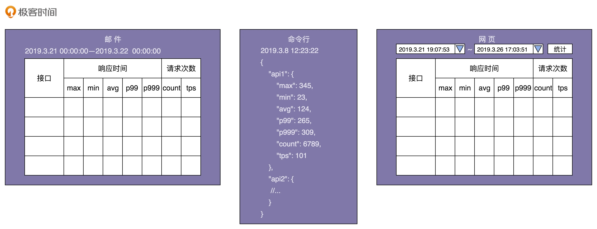

### （王争）结合一个支持各种统计规则的性能计数器项目
## 项目背景
我们希望设计开发一个小的框架，能够获取接口调用的各种统计信息，比如，响应时间的最大值（max）、最小值（min）、平均值（avg）、百分位值（percentile）、接口调用次数（count）、频率（tps） 等，并且支持将统计结果以各种显示格式（比如：JSON 格式、网页格式、自定义显示格式等）输出到各种终端（Console 命令行、HTTP 网页、Email、日志文件、自定义输出终端等），以方便查看。

##需求分析
### 1. 功能性需求分析
#### 接口统计信息：包括接口响应时间的统计信息，以及接口调用次数的统计信息等。
#### 统计信息的类型：max、min、avg、percentile、count、tps 等。
#### 统计信息显示格式：Json、Html、自定义显示格式。
#### 统计信息显示终端：Console、Email、HTTP 网页、日志、自定义显示终端。

